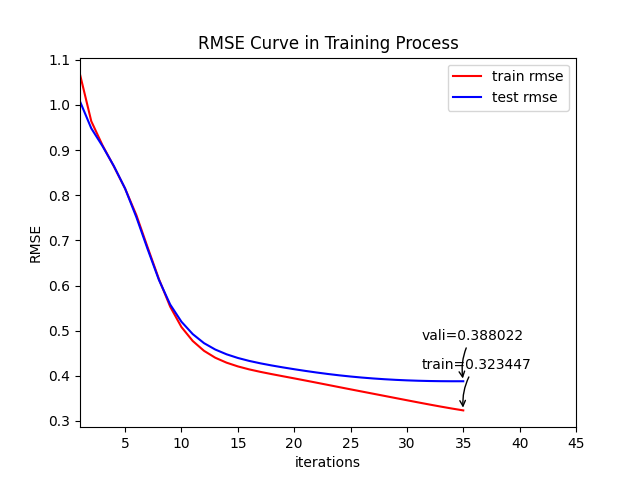

# Reinforcement Learning_UNITS24
Reinfrocement Learning project @ UNITS, Summer 2024

Annalisa Paladino, Luca Pernice, Emanuele Ruoppolo

This project is inspired by [Deep Reinforcement Learning based Recommendation with Explicit User-Item Interactions Modeling by Liu et al.](https://arxiv.org/abs/1810.12027). It purpose is to implement and test the framework of a DRL based reccomendation system.

To test the code first of all get the ```ratings.csv``` file from [MovieLens Data](https://www.kaggle.com/datasets/rounakbanik/the-movies-dataset) and run:

```
preprocessing.py

```

This will generate three files to use for training the PMF in order to get the data embeddings by running:
```
embedding.py

```


After finishing the traing the PMF model is ready to be used for training and evaluatin the Actor-Critic networks, by running:

```
drr.py

```
